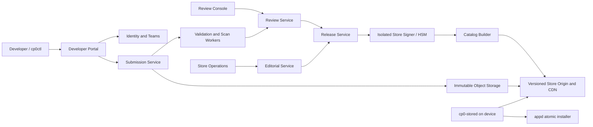

# CardputerZero Store 产品与技术架构

## 1. 定位与边界

CardputerZero Store 的目标不是简单地把 `.capp` 文件放到一个下载页，而是建立一条
从开发者身份、版本提交、自动检查、人工审核、Store 签名、目录发布，到设备端发现、
搜索、下载、安装和更新的完整产品链路。体验标准参考 Apple App Store 的清晰度、
可信度和一致性，但交互必须适配 320x170 屏幕、物理键盘、512 MB 内存和单前台模型。

首个产品版本只支持免费应用，不引入购买、订阅、广告归因、用户评论或用户云账户。
这些能力会显著扩大支付、隐私、反欺诈和合规边界，不能作为基础 Store 的隐含功能。

已经实现且继续复用的安全底座包括：

- 开发者和 Store 双 Ed25519 签名；
- 确定性 `.capp`、静态 WASM/import/权限检查和精确审核记录；
- 有序、限时、签名的静态 Catalog；
- HTTPS 公网约束、目录防回滚、断点续传和摘要校验；
- appd 二次验签、原子安装、严格升级和回滚；
- 独立 `cp0-stored` 身份、缓存和设备端有界控制协议。

## 2. 三层产品模型

### 2.1 Web 前端

Web 前端由三个站点组成，代码可以共享设计系统，但权限和部署必须分离。

#### Developer Portal

建议正式入口为 `developer.cardputerzero.dev`。它面向个人开发者和团队，提供：

- 账户、团队、成员角色和双因素认证；
- Developer ID、公钥登记、吊销和轮换；
- App ID 申请与永久归属，禁止抢注和转移后复用；
- 应用名称、简介、完整描述、分类、关键词、年龄分级、隐私说明、支持链接；
- 图标和 320x170 截图的上传、裁剪预览和本地化；
- 版本上传、自动检查结果、审核问题、回复和重新提交；
- 手动发布、预约发布、分阶段发布、暂停和撤回；
- 版本状态、安装量和崩溃率等最小化聚合指标。

开发者推荐工作流：

1. 使用 SDK 和 `cp0ctl new/build/run` 在本机开发；
2. 使用 `cp0ctl package` 和开发者私钥签名；
3. 使用 `cp0ctl store validate` 在上传前检查包和 Listing；
4. 使用浏览器上传，或由 `cp0ctl store submit` 通过 OAuth Device Flow 上传；
5. 在 Portal 查看自动检查和人工审核状态；
6. 审核通过后选择发布时间，后端生成 Store 签名产物；
7. 发布后查看版本覆盖率、失败率并管理更新。

私钥永远不上传 Portal。CLI 只上传开发者已签名的 `.capp`、Listing、资源和它们的
摘要。Portal 登录会话不能代替包内开发者签名。

#### Review Console

建议内部入口为 `review.cardputerzero.dev`，只允许审核员和安全运营人员访问：

- 自动扫描结果、manifest 权限、WASM imports 和历史版本差异；
- 应用实际运行截图、输入流程和权限触发记录；
- metadata、隐私说明、年龄分级和功能一致性检查；
- 结构化拒绝原因、补充材料请求、二次审核和升级处理；
- 双人审批的高风险权限、Store key 操作和紧急下架；
- 不可修改的审核事件时间线和审计导出。

Review Console 不直接持有 Store 私钥，也不能任意修改开发者提交。审核结论绑定提交包、
Listing 和资源清单的精确 SHA-256。

#### Store Operations

运营后台负责 Today 推荐、专题集合、分类排序、版本可见范围和紧急处置。运营只能从
已审核、未撤销的 Release 中选取内容，不能绕过审核发布任意包。每次变更生成新的有序
Catalog snapshot，并进入可审计的发布队列。

### 2.2 后端

后端分为控制面和不可变发布面。设备只访问发布面。



#### 控制面服务

| 服务 | 职责 | 关键约束 |
| --- | --- | --- |
| Identity and Teams | 登录、团队和角色 | 2FA、短会话、细粒度 RBAC |
| App Registry | App ID、名称和所有权 | ID 永不回收，所有权变更需审计 |
| Submission Service | 分片上传和提交状态机 | 幂等、摘要绑定、对象不可变 |
| Scan Workers | 包解析、WASM、权限、资源和恶意样本检查 | 无网络沙箱、有界 CPU/RAM/时间 |
| Review Service | 人工审核、问题和决定 | append-only 事件、提交内容不可改 |
| Release Service | 发布条件、版本和 rollout | 只接收 approved submission |
| Editorial Service | Today、分类、榜单和专题 | 只能引用可发布 Release |
| Catalog Builder | 构建签名目录和索引 | 确定性、单调 sequence、可重放 |
| Transparency Log | 发布、撤回、key 事件 | append-only、定期签名 checkpoint |

控制面 API 使用版本化 OpenAPI。写操作要求幂等键和乐观并发版本；所有状态变化记录
actor、时间、旧状态、新状态、对象摘要和原因。服务之间通过事务性 outbox 发送事件，
避免数据库提交成功而队列消息丢失。

#### 数据与存储

- PostgreSQL：账户、团队、App、Submission、Review、Release、Editorial 和审计索引；
- S3 兼容对象存储：原始 `.capp`、Listing、截图、扫描报告和已签名发布物；
- 工作队列：扫描、截图、审核通知、Catalog 构建和 CDN 发布；
- Redis 仅用于短期会话、限流和可重建缓存，不作为发布真相来源；
- Warehouse：只接收去标识化聚合事件，不能反向授权安装。

所有包、资源和 Catalog 都使用内容摘要命名。发布对象不覆盖，只创建新版本；下架通过
新的 Catalog snapshot 表达。数据库备份不能替代对象版本和 transparency log。

#### Store 签名服务

Store 签名是独立安全域：

- 在线服务只提交“已审核对象摘要 + 发布授权”；
- 私钥位于 HSM 或离线签名节点，不能被 Portal/Review Console 读取；
- 签名请求要求 Release Service 和审核策略共同授权；
- key rotation 使用新旧 Catalog 交叠和设备信任根更新窗口；
- 紧急吊销仍生成有序 Catalog，不能回滚 sequence；
- 每次签名写入不可变审计记录和 transparency checkpoint。

#### 发布面

设备不调用控制面数据库 API。发布面只提供：

- 签名的 discovery/catalog 索引；
- 按 app/version 固定路径发布的 Store 签名 `.capp`；
- 带摘要和尺寸的图标、截图与专题资源；
- 公钥轮换和撤销元数据；
- `ETag`、`Range`、合理缓存头和多区域 CDN。

首版仍可把不超过 64 个应用放在一个有界 Catalog。规模增长后使用签名根索引和分类/
搜索 shard；每个 shard 都有独立摘要、大小和 sequence 绑定，设备不会接受 CDN 自行
拼接的搜索 JSON。

### 2.3 设备端

设备端由可信 System Shell、`cp0-stored` 和 appd 三部分组成：

- System Shell：渲染 Store、接收键盘输入、展示权限和进度，不接触 URL 或包路径；
- `cp0-stored`：验证 Catalog/资源、执行本地搜索、下载和断点续传；
- appd：验证开发者和 Store 双签名，执行原子安装、升级、回滚和生命周期管理。

#### 320x170 信息架构

顶部保留 21 px 可信状态栏。Store 内容区使用固定的 18 px 分段导航和 4 行列表，不用
卡片嵌套或大标题：

| 入口 | 内容 | 主要动作 |
| --- | --- | --- |
| Today | 一个主推荐、两个专题入口、新品提示 | Enter 查看详情 |
| Apps | 分类、精选、全部应用 | Up/Down，Enter 进入 |
| Search | 固定搜索框、最近搜索、即时结果 | 物理键盘输入，Enter 详情 |
| Updates | 可用更新、进行中、最近更新 | Update All 或单项更新 |

320x170 上不永久显示底部 Tab Bar。F5/F6 或左右键在顶部四个分段间切换，焦点进入
列表后左右键只执行页面明确显示的操作。Back 先退出输入/详情，再返回 Home。

#### 应用详情

详情页按扫描顺序提供：名称/开发者、GET/UPDATE/OPEN、版本和大小、简介、权限与隐私、
截图、版本历史和支持链接。小屏每次显示一个区域；长文本按段分页，不做水平滚动。
安装前必须显示新增权限差异。安装中按钮变为稳定宽度的百分比/阶段状态，避免布局跳动。

#### 搜索

设备拥有物理键盘，因此搜索是一级入口。输入先在已验证的本地 Catalog 上完成：

- 查询最多 32 个 Unicode 字符和 96 字节；
- 匹配 name、app_id、summary，后续加入签名 keywords；
- 结果按精确名称、名称前缀、名称包含、summary/app_id 的稳定等级排序；
- 每页最多 8 条，协议返回 total 和 next_offset；
- 搜索不上传输入，也不需要登录；
- stale Catalog 可以搜索和浏览，但不能授权安装。

#### 下载与更新

- 同一时间只允许一个 Store 下载/安装任务，避免 CM0 内存和 SD 抖动；
- 用户可离开 Store，可信状态区继续显示进度；
- 网络中断保留经过边界检查的 `.part`，恢复必须验证 HTTP 206/Content-Range；
- 下载完成后重新核对字节数、SHA-256、Store 签名和开发者签名；
- 更新页只显示 appd 确认已安装且 Catalog 版本严格更高的应用；
- 自动更新默认关闭，后续只能在充电、网络和策略条件同时满足时启用。

## 3. 端到端状态机

### 3.1 开发者版本

```text
DRAFT -> UPLOADING -> PROCESSING -> READY_FOR_REVIEW
      -> IN_REVIEW -> NEEDS_CHANGES -> READY_FOR_REVIEW
      -> APPROVED -> READY_FOR_RELEASE -> PUBLISHED
      -> PAUSED | REMOVED
```

任何 package、Listing 或资源变化都创建新的 Submission revision 并重新审核，不能在
`APPROVED` 对象上原地改字。拒绝、撤回和下架保留历史。

### 3.2 设备安装

```text
AVAILABLE -> QUEUED -> DOWNLOADING -> VERIFYING -> INSTALLING -> INSTALLED
                               \-> FAILED / PAUSED
```

协议必须把失败类型限制为稳定、用户可理解的类别；详细主机路径、TLS 库错误和内部
命令不得暴露给 Shell。重试从安全检查点开始，不得跳过验证。

## 4. 核心数据模型

| 实体 | 稳定标识 | 关键绑定 |
| --- | --- | --- |
| Developer/Team | UUID | 登录身份、角色、2FA 状态 |
| Developer Key | key_id | team、状态、创建/吊销时间 |
| App | app_id | owner team、默认语言、策略状态 |
| Listing Revision | digest | app/version、文案、分类、资源摘要 |
| Submission | submission_id | `.capp` SHA-256、developer key、Listing digest |
| Scan Report | report_id | submission digest、工具链版本、结论 |
| Review Decision | decision_id | submission、reviewer、字段级原因 |
| Release | release_id | approved submission、范围、发布时间 |
| Catalog Snapshot | sequence | releases、editorial、资源摘要、签名 |

Listing v1 至少包含 `app_id`、`version`、locale、subtitle、description、category、
keywords、age_rating、privacy_url、support_url、release_notes、icon 和截图资源清单。
所有字符串和数组都有字符、字节、数量上限；URL 只允许 HTTPS 且禁止凭据和 fragment。
冻结的字段、目录约定和资源边界见 `STORE-LISTING-V1.md`。

## 5. API 边界

Developer API 首版建议：

```text
POST   /v1/apps
GET    /v1/apps/{app_id}
POST   /v1/apps/{app_id}/submissions
PUT    /v1/submissions/{id}/parts/{part}
POST   /v1/submissions/{id}:finalize
GET    /v1/submissions/{id}
POST   /v1/submissions/{id}/messages
POST   /v1/releases
POST   /v1/releases/{id}:publish
POST   /v1/releases/{id}:pause
```

大文件上传使用短期、单对象、限尺寸的 presigned URL。finalize 请求必须提交所有对象
摘要；后端重新读取对象并校验，不信任浏览器报告的大小和 SHA。

设备协议不复用这些 HTTP API。Shell 只通过 Unix socket 发出 `list/search/refresh/install`
等有界命令；`cp0-stored` 再读取已经签名的发布面对象。

## 6. 隐私、合规和运营质量

- 默认不收集搜索词、设备标识、SSID、IP 历史或应用私有数据；
- 安装/崩溃指标采用明确同意、随机批次和最小粒度聚合；
- Developer Portal 和 Review Console 的日志视为敏感审计数据；
- 隐私标签由开发者声明并经审核，不会自动扩大运行时权限；
- 年龄分级、出口管制、内容政策和下架申诉需要独立政策文档；
- Catalog 发布目标：99.9% 可用，错误发布可在 15 分钟内通过更高 sequence 撤回；
- 后端恢复演练必须证明数据库、对象、队列和签名审计可以一致恢复。

## 7. 当前实现与目标差距

| 能力 | 当前状态 | 目标 |
| --- | --- | --- |
| 开发者发布 | 本地目录 + 手工 review JSON | Portal/CLI 上传、状态流、团队管理 |
| 审核 | 精确静态记录 | 自动扫描 + Review Console + 审计事件 |
| Catalog | 64 应用单文件 | discovery/editorial/search shard 与资源摘要 |
| 设备浏览 | 单一列表和详情 | Today/Apps/Search/Updates |
| 搜索 | 协议、`cp0-stored` 和 CLI 已实现 | System Shell 搜索页，后续签名 shard |
| 资源 | 无 Store 图标/截图管线 | 审核绑定、摘要校验、设备缓存 |
| 下载 | 单任务、续传、验签 | 可暂停/恢复、统一进度、更新队列 |
| 用户账户 | 无 | 首版保持无账户；未来另立安全设计 |
| 商业化 | 无 | 不在首版范围 |

## 8. 架构决策

1. 设备安装授权来自 Store 签名，不来自 Portal 登录或 CDN TLS。
2. 控制面与发布面分离，设备不依赖数据库/API 在线可用。
3. 首版搜索在签名 Catalog 上本地执行，保护隐私并适配最多 64 个应用。
4. Listing、资源和包作为一个审核 revision 绑定，审批后不能原地修改。
5. 首版只支持免费应用；支付和用户账户必须经过单独威胁模型与合规评审。
6. 任何高质量视觉资源都必须有摘要、尺寸、格式和像素上限，不能直接信任 CDN 内容。
7. 本地 Store socket 的搜索命令作为协议 v1 的可选增量：旧客户端不会收到未经请求的
   搜索响应，新客户端连接旧服务会得到严格的 invalid-request；产品镜像仍统一升级
   Shell、CLI、`cp0-stored` 和协议库，跨版本混用不作为受支持部署方式。
