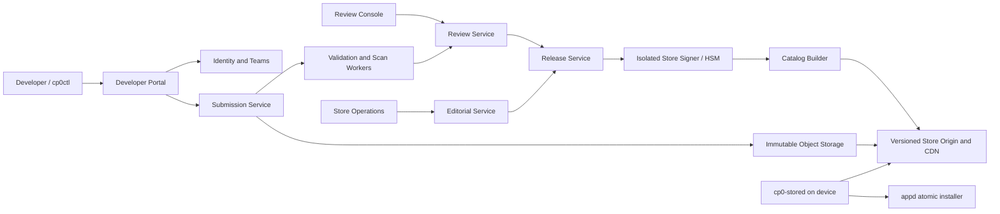

# CardputerZero Store Product and Technical Architecture

<!-- doc-locale: en -->
> **English** | [简体中文](STORE-ARCHITECTURE.zh-CN.md)

## 1. Positioning and Boundaries

The CardputerZero Store is not merely a download page for `.capp` files. It establishes an
end-to-end product path from developer identity, version submission, automated checks,
manual review, Store signing, and Catalog publication to on-device discovery, search,
download, installation, and update. Its experience should have the clarity, trust, and
consistency of the Apple App Store while fitting a 320x170 display, physical keyboard,
512 MB of memory, and the single-foreground model.

The first product release supports free apps only. It does not include purchases,
subscriptions, advertising attribution, user reviews, or user cloud accounts. Those
features would substantially expand payment, privacy, anti-fraud, and compliance boundaries
and must not be treated as implicit capabilities of the base Store.

The existing security foundation remains in use:

- separate Ed25519 signatures from the developer and Store;
- deterministic `.capp` packages, static WASM/import/permission checks, and exact review
  records;
- ordered, expiring, signed static Catalogs;
- public HTTPS restrictions, Catalog rollback protection, resumable downloads, and digest
  verification;
- appd signature revalidation, atomic installation, strict upgrades, and rollback;
- a dedicated `cp0-stored` identity, cache, and bounded on-device control protocol.

## 2. Three-Layer Product Model

### 2.1 Web Frontends

The web layer comprises three sites. They may share a design system, but authorization and
deployment must remain separate.

#### Developer Portal

The proposed production entry point is `developer.cardputerzero.dev`. It serves individual
developers and teams with:

- accounts, teams, member roles, and two-factor authentication;
- Developer ID public-key registration, revocation, and rotation;
- App ID allocation and permanent ownership, preventing name squatting and reuse after
  transfer;
- app name, subtitle, full description, category, keywords, age rating, privacy statement,
  and support link;
- icon and 320x170 screenshot upload, crop preview, and localization;
- version upload, automated check results, review questions, replies, and resubmission;
- manual, scheduled, and phased release, plus pause and withdrawal;
- minimal aggregate metrics such as version adoption, installation count, and crash rate.

Recommended developer workflow:

1. Develop locally with the SDK and `cp0ctl new/build/run`.
2. Package with `cp0ctl package` and sign with the developer private key.
3. Run `cp0ctl store validate` on the package and Listing before upload.
4. Upload in the browser or with `cp0ctl store submit` through OAuth Device Flow.
5. Inspect automated checks and manual-review status in the Portal.
6. After approval, choose a publication time; the backend creates the Store-signed artifact.
7. After publication, inspect adoption and failure rates and manage updates.

The private key is never uploaded to the Portal. The CLI uploads only the developer-signed
`.capp`, Listing, resources, and their digests. A Portal login session cannot replace the
developer signature embedded in the package.

#### Review Console

The proposed internal entry point is `review.cardputerzero.dev`. Access is limited to
reviewers and security-operations personnel. It provides:

- automated scan results, manifest permissions, WASM imports, and historical-version diffs;
- screenshots from actual execution, input flows, and permission-trigger records;
- metadata, privacy-statement, age-rating, and functional-consistency checks;
- structured rejection reasons, requests for more material, secondary review, and escalation;
- two-person approval for high-risk permissions, Store-key operations, and emergency removal;
- an immutable review-event timeline and audit export.

The Review Console does not hold the Store private key and cannot arbitrarily modify a
developer submission. A decision binds to the exact SHA-256 of the package, Listing, and
resource inventory.

#### Store Operations

Store Operations manages Today recommendations, featured collections, category ordering,
release visibility, and emergency response. Operators may select only reviewed,
non-withdrawn Releases; they cannot bypass review to publish an arbitrary package. Every
change creates a new ordered Catalog snapshot and enters an auditable publication queue.

S8A implements the first Today control-plane vertical slice. An independent operator
identity, 2FA, the `store.editorial` scope, strong ETags, and idempotent writes protect
`GET/POST/PUT /v1/editorial/today`. The layout is fixed to one lead recommendation and one
or two collections containing one to four apps each. References must point to Releases that
remain published and whose Submissions remain approved; duplicate Releases or Apps are
rejected. Each write atomically creates an immutable revision, audit record, and Catalog
rebuild outbox event bound to that revision. See `STORE-EDITORIAL-V1.md`.

### 2.2 Backend

The backend is split into a control plane and an immutable publication plane. Devices access
only the publication plane.



#### Control-Plane Services

| Service | Responsibility | Key constraint |
| --- | --- | --- |
| Identity and Teams | Login, teams, and roles | 2FA, short sessions, fine-grained RBAC |
| App Registry | App IDs, names, and ownership | IDs are never recycled; ownership changes are audited |
| Submission Service | Chunked upload and submission state machine | Idempotency, digest binding, immutable objects |
| Scan Workers | Package parsing, WASM, permissions, resources, and malicious-sample checks | No-network sandbox; bounded CPU, RAM, and time |
| Review Service | Manual review, questions, and decisions | Append-only events; submission content is immutable |
| Release Service | Publication conditions, versions, and rollout | Accepts approved Submissions only |
| Editorial Service | Today, categories, rankings, and collections | References releasable Releases only |
| Catalog Builder | Signed Catalogs and indexes | Deterministic, monotonic sequence, replayable |
| Transparency Log | Publication, withdrawal, and key events | Append-only, periodically signed checkpoints |

Control-plane APIs use versioned OpenAPI. Writes require idempotency keys and optimistic
concurrency versions. Every state transition records the actor, time, old state, new state,
object digest, and reason. Services publish events through transactional outboxes so a
successful database commit cannot lose its queue message.

#### Data and Storage

- PostgreSQL stores accounts, teams, Apps, Submissions, Reviews, Releases, Editorial state,
  and audit indexes.
- S3-compatible object storage holds original `.capp` files, Listings, screenshots, scan
  reports, and signed publication artifacts.
- Work queues carry scan, screenshot, review-notification, Catalog-build, and CDN-publication
  jobs.
- Redis is limited to short-lived sessions, rate limits, and rebuildable caches. It is not a
  source of publication truth.
- The warehouse accepts only de-identified aggregate events and cannot authorize an
  installation in reverse.

Packages, resources, and Catalogs are all named by content digest. Published objects are not
overwritten; a new version creates a new object, and removal is represented by a later
Catalog snapshot. Database backups do not replace object versioning or the transparency log.

#### Store Signing Service

Store signing is an independent security domain:

- online services submit only an approved-object digest plus publication authorization;
- the private key resides in an HSM or offline signing node and cannot be read by the Portal
  or Review Console;
- a signing request requires authorization from both Release Service and review policy;
- key rotation overlaps old and new Catalogs with a device trust-root update window;
- emergency revocation still creates an ordered Catalog and cannot roll its sequence back;
- every signature creates an immutable audit record and transparency checkpoint.

S5H implements the first bounded vertical slice of this log. Each Catalog snapshot
atomically writes a leaf and signed checkpoint, and Publisher recalculates the complete
prefix at startup. Compact consistency proofs, external witnesses, gossip, and a production
HSM remain future infrastructure. See `STORE-TRANSPARENCY.md`.

#### Publication Plane

Devices do not call control-plane database APIs. The publication plane exposes only:

- signed discovery and Catalog indexes;
- Store-signed `.capp` files at fixed app/version paths;
- icons, screenshots, and collection resources with digests and dimensions;
- public-key rotation and revocation metadata;
- `ETag`, `Range`, appropriate cache headers, and a multi-region CDN.

S6E retains the legacy Catalog when it contains no more than 64 entries and encodes to no
more than 48 KiB. When either limit is reached first, Publisher switches to a signed root
index and at most 16 bounded shards. The root signature binds the category index and each
shard's URL, digest, size, count, App ID range, and sequence; every shard also has an
independent signature domain. The device validates the complete generation before atomically
switching its cache. It does not accept search or category JSON assembled by the CDN.

### 2.3 Device

The device layer consists of the trusted System Shell, `cp0-stored`, and appd:

- System Shell renders the Store, accepts keyboard input, and displays permissions and
  progress without handling URLs or package paths.
- `cp0-stored` validates Catalogs and resources, performs local search, and downloads and
  resumes transfers.
- appd verifies both developer and Store signatures and handles atomic install, upgrade,
  rollback, and lifecycle operations.

#### 320x170 Information Architecture

The top 21 px remain a trusted status bar. The Store content area uses an 18 px segmented
navigation row and a four-row list, with no nested cards or oversized headings:

| Section | Content | Primary action |
| --- | --- | --- |
| Today | One lead recommendation, two collection entries, new-release indication | Enter opens details |
| Apps | Categories, featured, and all apps | Up/Down, then Enter |
| Search | Fixed search field, recent searches, and live results | Type on the physical keyboard; Enter opens details |
| Updates | Available, active, and recent updates | Update All or update one app |

There is no permanent bottom tab bar at 320x170. F5/F6 or Left/Right switches among the four
top segments. Once focus enters a list, Left/Right performs only actions visibly assigned by
that page. Back leaves input or details first, then returns Home.

#### App Details

Details are presented in scan order: name and developer; GET, UPDATE, or OPEN; version and
size; summary; permissions and privacy; screenshots; version history; and support link. The
small screen shows one region at a time. Long text paginates by paragraph and never scrolls
horizontally. Installation must first show any newly requested permission. During install,
the button changes to a stable-width percentage or phase label to prevent layout movement.

#### Search

The physical keyboard makes search a top-level destination. Queries first run against the
verified local Catalog:

- at most 32 Unicode characters and 96 bytes;
- matches `name`, `app_id`, and `summary`, with signed keywords added later;
- stable ranking by exact name, name prefix, name substring, then summary/app_id;
- at most eight results per page, with `total` and `next_offset` in the protocol;
- query text is not uploaded and no login is required;
- a stale Catalog can be searched and browsed but cannot authorize installation.

The current System Shell accepts up to 32 ASCII letters, digits, spaces, periods, hyphens,
and underscores directly from the physical keyboard. The protocol retains the 96-byte UTF-8
limit for a future trusted input method. Recent queries exist only in Shell process memory,
are cleared on restart, are not written to the SD card, and are not sent over the network.
Every request binds its query, offset, and limit. Previous/Next pagination displays at most
eight entries and does not copy the complete Catalog into the UI.

S6A Catalog v2 signs developer, subtitle, category, keywords, and age/privacy metadata, and
`cp0-stored` uses those fields for local search. S6E `browse` IPC/CLI uses category counts
signed by the root and returns at most eight entries per page. Legacy `list` remains for
compatibility and exposes only the bounded first page of up to 64 entries. Updates appear
only when the Catalog version is strictly greater under SemVer than the installed version
reported by appd. Older versions, equal versions, and prerelease downgrades remain
`INSTALLED` and cannot masquerade as updates.

S6B Catalog v3 binds an icon and bounded details list in each summary, while the details
bind screenshots. Publisher places all resources in the same immutable generation as the
package. The root Catalog does not inline long descriptions or screenshot arrays, keeping a
64-app Catalog below 48 KiB. S6C gives `cp0-stored` separate 4 MiB icon, 1 MiB details, and
8 MiB screenshot caches. Objects are digest-named, downloaded by one job, structurally
revalidated, and atomically committed; screenshots use a stable LRU. Media failure is
isolated from Catalog and app installation. S6D connects icons, descriptions, screenshots,
permission diffs, and release notes to System Shell through strict details/media IPC.

S6E adds a signed root index, signed category index, and independent shards. Publisher packs
by both app count and actual signed encoded bytes; PostgreSQL's completion trigger requires
the root and shard counts to close exactly over the total app count. `cp0-stored` downloads
and validates every shard in order, installs a private generation directory, and only then
atomically replaces the root cache. Missing, out-of-order, truncated, replaced, or
same-sequence/different-content data leaves the prior generation active.

S8A Catalog v4 adds a signed editorial projection to v3 and binds each editorial rebuild job
to an immutable editorial resource version. Publisher emits v4 only if every referenced
Release remains publishable, artifact identity matches, and the App exists in the same
Catalog. A paused, removed, replaced, or missing reference safely degrades to v3 without
editorial content. `cp0-stored` returns bounded, complete app summaries from the same
sequence through separate `today` IPC. System Shell clears editorial state on a sequence
mismatch, stale Catalog, null response, or parse failure so it never combines two snapshots.

S8B adds an optional aggregate path entirely separate from the Catalog. `cp0-stored`
exclusively owns bounded weekly state at mode 0600. System Shell may only read status and set
consent; appd, as root, may submit only launch/crash counts for an exact installed version.
The device neither stores nor sends a device ID, event timestamp, search terms, logs, exit
status, or stack trace, and uploads only the previous complete UTC week. It persists a random
128-bit batch ID before the first request and deletes local weekly data only after an HTTPS
202 response echoes that exact ID. The backend keeps digest receipts for 15 days to
deduplicate, validates published artifacts, and withholds public aggregates until at least 20
independent batches exist. See `STORE-METRICS-V1.md`.

#### Download and Update

- Only one Store download/install job may run at a time, avoiding CM0 memory and SD-card
  contention.
- Users may leave the Store while the trusted status area continues to show progress.
- Network interruption retains a boundary-checked `.part`; resumption must validate HTTP 206
  and `Content-Range`.
- Completion rechecks byte length, SHA-256, Store signature, and developer signature.
- Updates lists only apps appd confirms are installed and whose Catalog version is strictly
  greater.
- Automatic update is disabled by default and may later run only when power, network, and
  policy conditions all permit it.

## 3. End-to-End State Machines

### 3.1 Submission Revision

```text
DRAFT -> UPLOADING -> PROCESSING -> READY_FOR_REVIEW -> IN_REVIEW
      -> WITHDRAWN       -> NEEDS_CHANGES | REJECTED
                                            -> APPROVED
```

`NEEDS_CHANGES`, `APPROVED`, `REJECTED`, and `WITHDRAWN` are terminal for a revision. Any
change to the package, Listing, or resources creates a new incremented revision and requires
another review; an old object is never edited in place.

### 3.2 Release

```text
READY -> SCHEDULED -> PUBLISHING -> PUBLISHED <-> PAUSED
                    -> PUBLISH_FAILED -> READY
      -> REMOVED
```

A Release can reference only an `APPROVED` Submission. Publishing, pausing, resuming, and
removing each create a higher-sequence Catalog. See `STORE-CONTROL-API-V1.md` for the exact
transition authorization, concurrency, and idempotency contract.

### 3.3 Device Installation

```text
AVAILABLE -> QUEUED -> DOWNLOADING -> VERIFYING -> INSTALLING -> INSTALLED
                               \-> FAILED / PAUSED
```

The protocol limits failures to stable, user-comprehensible categories. Detailed host paths,
TLS-library errors, and internal commands must not reach System Shell. Retry resumes only
from a secure checkpoint and never skips verification.

## 4. Core Data Model

| Entity | Stable identifier | Key binding |
| --- | --- | --- |
| Developer/Team | UUID | Login identity, role, 2FA state |
| Developer Key | key_id | Team, state, creation/revocation time |
| App | app_id | Owner Team, default locale, policy state |
| Listing Revision | digest | App/version copy, category, resource digests |
| Submission | submission_id | `.capp` SHA-256, developer key, Listing digest |
| Scan Report | report_id | Submission digest, toolchain version, decision |
| Review Decision | decision_id | Submission, reviewer, field-level reasons |
| Release | release_id | Approved Submission, scope, publication time |
| Editorial Revision | layout_id + resource_version | Operator, approved published Releases, audit/outbox |
| Catalog Snapshot | sequence | Releases, editorial projection, resource digests, signature |

Listing v1 contains at least `app_id`, `version`, locale, subtitle, description, category,
keywords, age_rating, privacy_url, support_url, release_notes, icon, and screenshot resource
inventory. Every string and array has character, byte, and count bounds. URLs require HTTPS
and prohibit credentials and fragments. See `STORE-LISTING-V1.md` for the frozen fields,
directory conventions, and resource bounds.

## 5. API Boundary

Initial Developer API surface:

```text
POST   /v1/apps
GET    /v1/apps/{app_id}
POST   /v1/apps/{app_id}/submissions
PUT    /v1/submissions/{id}/parts/{part}
POST   /v1/submissions/{id}:finalize
GET    /v1/submissions/{id}
POST   /v1/submissions/{id}/messages
POST   /v1/releases
POST   /v1/releases/{id}:publish
POST   /v1/releases/{id}:pause
GET    /v1/editorial/today
POST   /v1/editorial/today
PUT    /v1/editorial/today
```

The frozen OpenAPI 3.1 contract is `schemas/store-control-v1.openapi.json`; the table above
is only an endpoint summary.

Large-object upload uses short-lived presigned URLs restricted to one object and a bounded
size. A finalize request supplies every object digest; the backend rereads and verifies the
objects and does not trust size or SHA values reported by the browser.

The device protocol does not reuse these HTTP APIs. System Shell sends bounded commands such
as `list`, `today`, `search`, `refresh`, and `install` over a Unix socket. `cp0-stored` then
reads signed publication-plane objects. A Today response must exactly match the Catalog
sequence most recently read; Catalog v1 through v3 return `editorial: null`.

## 6. Privacy, Compliance, and Operational Quality

- Search terms, device identifiers, SSID history, IP history, and app-private data are not
  collected by default.
- Install/crash metrics use explicit consent, random batches, and minimal aggregation.
- Developer Portal and Review Console logs are sensitive audit data.
- Developers declare privacy labels and reviewers verify them; labels do not expand runtime
  permissions.
- Age rating, export control, content policy, and removal appeals require separate policy
  documents.
- The Catalog publication target is 99.9% availability; an incorrect publication can be
  withdrawn within 15 minutes through a higher sequence.
- Backend recovery drills must prove consistent restoration of the database, objects,
  queues, and signing audit.

## 7. Current Implementation Gaps

| Capability | Current state | Target |
| --- | --- | --- |
| Developer publication | Local directory plus manual review JSON | Portal/CLI upload, state flow, Team management |
| Review | Exact static records | Automated scan, Review Console, audit events |
| Catalog | v4 single file with discovery, resource digests, and editorial | Signed shards above 64 apps |
| Device browsing | Today/Apps/Search/Updates and rich details | Category index and later product iteration |
| Search | Local protocol, daemon, CLI, and Shell implemented | Signed shards above 64 apps |
| Resources | Review binding, digest checks, device cache, and Shell display | CDN/cache hardware-capacity gate |
| Download | Pause/resume, unified progress, update queue, and automatic-update policy | S9 real power/network-loss evidence |
| User account | None | Remain account-free in v1; future work requires a separate security design |
| Commerce | None | Outside v1 scope |

## 8. Architecture Decisions

1. Device installation authority comes from the Store signature, not Portal login or CDN
   TLS.
2. The control and publication planes are separate; a device does not depend on database or
   control-API availability.
3. Initial search runs locally over a signed Catalog, preserving privacy and supporting up
   to 64 apps.
4. A review revision binds the Listing, resources, and package; approved content cannot be
   modified in place.
5. The first release supports free apps only. Payments and user accounts require a separate
   threat model and compliance review.
6. Every rich visual resource has digest, dimensions, format, and pixel bounds. CDN content
   is never trusted directly.
7. Local Store-socket `search` is an optional protocol-v1 extension. Old clients receive no
   unsolicited search response, and new clients connected to an old service receive a strict
   invalid-request result. Product images still upgrade System Shell, CLI, `cp0-stored`, and
   protocol libraries together; cross-version mixing is unsupported.
8. Editorial layouts reference Releases only, and devices accept only App projections from
   the same signed Catalog. Editorial mutations bind immutable revisions; an invalid
   reference degrades to v3 and never displays an expired recommendation.

The initial engineering baseline for content, privacy, review, appeals, and removal is
`STORE-POLICY-V1.md`. Production policy text still requires approval from product, security,
and legal owners.
