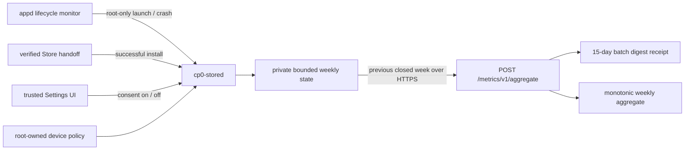

# Store aggregate metrics v1

S8B adds an optional Store quality signal without creating a device identity or
uploading raw activity. Consent defaults to off. The device keeps only bounded
weekly counters for exact published application versions and sends only the
immediately previous complete UTC week.

## Data contract

`AggregateMetricsReport` is strict JSON with these fields:

- `schema_version`: fixed to `1`;
- `batch_id`: `batch_` plus 128 random bits encoded as lowercase hex;
- `week_start_unix_seconds`: Monday 00:00:00 UTC;
- `records`: 1 to 64 canonical `(app_id, version)` records;
- each record contains only `installs`, `launches`, and `crashes` counters.

The schema has no device, account, network, hardware or installation identity.
It has no event timestamp, search term, intent payload, permission decision,
crash stack, exit status, log line or arbitrary metadata field. Unknown fields
are rejected at every decoder.

Per application version and week, installs are capped at 8 and launches at
4096. Crashes can never exceed launches. The complete report is capped at 32
KiB. The private device state retains at most the current and previous week,
uses mode `0600`, rejects symlinks and unsafe ownership, and is committed with
write, `fsync`, rename and parent-directory `fsync`.

## Consent and policy

The independent device policy field `store_metrics_allowed` defaults to false
when omitted from an older policy. Product policy files currently allow the
feature, but user consent remains off. `metrics_url` is independent from
`catalog_url`; an empty endpoint keeps the setting unavailable.

The System Shell exposes **Settings > Apps & Privacy > App Metrics**. Enabling
opens a 320x170 consent dialog whose selected action defaults to Cancel.
Disabling consent atomically replaces the persistent state with an empty,
disabled state. A policy revocation, missing policy, invalid policy or removed
endpoint also fails closed and clears every unsent aggregate.

Search terms are not part of this contract and remain process-local in the
Shell. Experiments are not authorized by metrics consent.

## Device flow

`appd` reports a launch only after systemd confirms the single foreground unit
is active. A single blocking systemd observer waits for that unit to stop; only
an observer error uses a five-second retry. An explicit Stop, including an
intent-driven foreground switch, suppresses crash counting; an unexpected unit
disappearance records one crash. Reports contain no stack or exit details and
failure to reach Store never blocks application lifecycle.

Store records an install only after `appd` accepts the verified package handoff.
Runtime metric commands are accepted only from UID 0 and are checked against
the exact installed App ID and version.

## Upload and backend

Before its first attempt, `cp0-stored` creates and durably saves a random batch
ID with the previous complete week. Retries reuse the exact report. Local state
is removed only after HTTP 202 returns strict JSON with `accepted: true` and the
exact same `batch_id`. A timeout, malformed response, different ID or service
restart retains the pending report.

The unauthenticated endpoint accepts only the immediately previous closed week
and only App ID/version pairs backed by a valid published package artifact. It
stores a digest receipt for idempotency and conflict detection for 15 days; it
does not persist request bodies, IP addresses, device fields, raw events or
crash data. Immutable batch triggers and monotonic aggregate triggers reject
direct SQL tampering.

Public aggregate rows remain hidden until at least 20 accepted batches
contribute to that App ID/version/week. Batch IDs and receipt details are never
part of the public view.

## Verification

Local gates cover strict schema rejection, secure state persistence, default-off
consent, consent and policy clearing, root-only runtime recording, bounded
counters, retry identity, exact acknowledgement and the 320x170 default-Cancel
dialog. PostgreSQL acceptance covers current-week rejection, replay,
conflicting IDs, unpublished artifacts, the 19/20 privacy threshold, retention
cleanup and immutable/monotonic database enforcement.

S9 must deploy the binaries only after the current stability observation ends.
Device acceptance must verify the setting and lifecycle behavior without
enabling production collection or uploading identifying test data.
