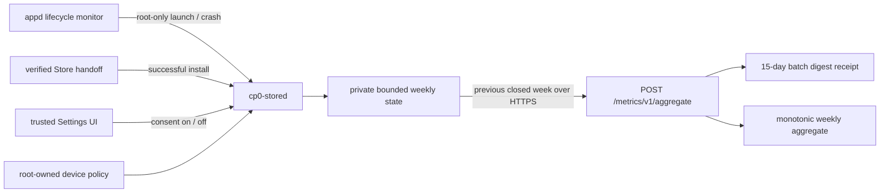

# 存储聚合指标 v1

<!-- doc-locale: zh-CN -->
> [English](STORE-METRICS-V1.md) | **简体中文**

S8B 添加了一个可选的 Store 质量信号，而无需创建设备身份或上传原始活动。同意默认为关闭。设备仅保留精确发布的应用程序版本的有限每周计数，并仅发送最近完整的 UTC 周。

## 数据契约

`AggregateMetricsReport` 是严格的 JSON，包含这些字段：

- `schema_version`: 固定为`1`；
- `batch_id`: `batch_` 加上 128 位随机数，以小写十六进制编码；
- `week_start_unix_seconds`: 周一 00:00:00 UTC
- `records`: 1到64个标准`(app_id, version)`记录；
- 每条记录仅包含 `installs`, `launches`, 和 `crashes` 计数器。

该模式没有设备、账户、网络、硬件或安装身份。
它没有事件时间戳、搜索词、意图载荷、权限决定，
崩溃堆栈、退出状态、日志行或任意元数据字段。未知字段
在每个解码器处都被拒绝。

按应用程序版本和每周，安装数量上限为8，启动次数上限为
4096. 崩溃次数永远不会超过启动次数。完整的报告最多为 32 KiB。私有设备状态最多保留当前和上一周的状态，使用模式 `0600`，拒绝符号链接和不安全的所有权，并通过写入、`fsync` 重命名和父目录 `fsync` 提交。

## 同意和政策

独立设备策略字段`store_metrics_allowed`在从较旧策略中省略时默认为 false。产品策略文件当前允许该功能，但用户同意仍为关闭状态。`metrics_url`与`catalog_url`独立；空端点保持设置不可用。

System Shell 提供 **Settings > Apps & Privacy > App Metrics**。启用时会打开一个 320x170 的同意对话框，默认选中 Cancel。撤回同意会以空的 disabled 状态原子替换持久状态。策略撤销、策略缺失或无效、端点移除也会关闭该功能并清除所有未发送的聚合数据。

搜索词不是本合同的一部分，在Shell中保持过程本地化。实验未经授权由度量标准同意。

## 设备流

`appd` 只在 systemd 确认单个前台单元活跃后才报告启动。一个单一的阻塞 systemd 观察者等待该单元停止；只有观察者错误使用五秒重试。显式的 Stop，包括意图驱动的前台切换，抑制崩溃计数；意外单元消失记录一次崩溃。报告不包含堆栈或退出详细信息，Store 无法到达也不会阻塞应用程序生命周期。

Store 只在 `appd` 接受验证过的软件包移交后记录安装。
Runtime 计量命令仅从 UID 0 接受，并与精确安装的 App ID 和版本进行检查。

`cp0ctl store metrics` 是一个只读诊断命令。它只暴露四个布尔值（`enabled`，策略允许，端点配置和待处理）并且不能授予同意或改变计数器。

## 上传和后台

在第一次尝试之前，`cp0-stored` 创建并持久保存了一个随机批次ID，该ID对应于上一个完整的周。重试会使用相同的报告。只有在HTTP 202返回严格的JSON并且包含`accepted: true`和完全相同的`batch_id`时，本地状态才会被移除。超时、格式错误的响应、不同的ID或服务重启都会保留待处理的报告。

未认证的端点只接受最近关闭的一周，并且只接受由有效发布的包 artifact 支撑的 App ID/版本对。它存储一个摘要收据以确保幂等性和冲突检测，持续时间为 15 天；它不持久化请求体、IP 地址、设备字段、原始事件或崩溃数据。不可变批次触发器和单调聚合触发器拒绝直接 SQL 篡改。

公共聚合行在至少有20个接受批次贡献给该App ID/版本/周之前保持隐藏。批次ID和收据细节永远不包含在公共视图中。

## 验证

本地门覆盖严格的模式拒绝，安全的状态持久化，默认关闭的同意，同意和策略清除，仅根用户的运行时记录，有界计数器，重试身份，精确确认以及170x320默认-Cancel对话框。PostgreSQL接受覆盖当前周拒绝，重放，冲突ID，未发布的制品，19/20隐私阈值，保留清理和不可变/单调数据库强制执行。

S9必须在当前稳定性观察结束后才部署二进制文件。
每次六步Store设备运行都会捕获只读指标状态，除非同意关闭且没有聚合待处理才会被拒绝。安装/升级启动探针也需要恰好出现并显式停止后退出的阻塞`systemctl wait`观察者。这验证了生命周期集成，而不启用收集或上传标识性测试数据。
