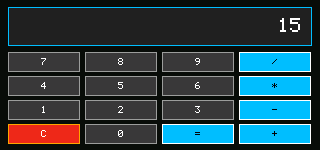

# 计算器

<!-- doc-locale: zh-CN -->
> [English](README.md) | **简体中文**

计算器是为CardputerZero键盘内置的一个权限免费的算术应用程序。它执行有界有符号整数算术，并在显示中显示除零错误。



## 控制按钮

- `0`-`9`：输入数字。
- `+`, `-`, `*`, `/`: 选择一个操作符。在V0.6版本上，使用打印的`Sym`符号组合。
- 箭头键：选择屏幕上的任意数字或运算符；Enter确认选择。这在输入符号不方便时提供了一个完整的备用方案。
- 空间：激活选定的屏幕键。
- `=` 或输入：计算结果。
- `C`: 清除计算。
- Backspace：删除最后一位数字。

## 在模拟器中运行

从仓库根目录:

```sh
cargo run -p cp0ctl -- run examples/calculator \
  --duration 250 --permissions deny \
  --keys 1,2,plus,3,equal \
  --output target/calculator.ppm
```

该应用请求 no 权限，并且是包含在生产镜像中的八个应用之一。
