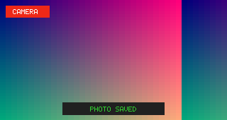

# Camera

Camera displays a live 320x170 preview from the trusted camera broker and can
save a captured RGB565 frame to the shared photo library.



## Controls

- Enter or Space: save the current frame.
- `Esc`: leave the application through the System Shell.

The first launch can show permission prompts for `camera.capture` and
`photos.write`. Denying either permission keeps the app isolated and produces
an explicit unavailable or denied state.

## Run in the simulator

```sh
cargo run -p cp0ctl -- run examples/camera \
  --duration 700 --permissions allow --keys enter \
  --output target/camera.ppm
```

Camera is one of the eight applications included in the product image.
