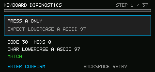

# 键盘诊断

<!-- doc-locale: zh-CN -->
> [English](README.md) | **简体中文**

这个专注于SDK的应用记录通过可信Runtime输入边界传递的键盘事件。它不打开evdev也不修改键盘配置。



引导序列涵盖：

- 小写，不使用Shift键；
- 按下物理Shift键时大写输入；
- 释放modifier键而不处于粘滞的Shift状态；
- 所有32 `Sym` 来自 V0.6 键盘参考 CSV 的组合。

对于每一步，请按下请求的键或组合键。审查屏幕显示接收到的 Linux 键码、修饰符掩码、解码的 V0.6 ASCII 名称/代码以及是否与预期事件匹配。显示的字符由 Runtime 生成，并直接从 SDK 事件中读取。按下 Enter 确认并继续，或按下 Backspace 撤销捕获并重新尝试同一步骤。

## 在模拟器中运行

```sh
cargo run -p cp0ctl -- run examples/keyboard-diagnostics \
  --duration 600 --permissions deny --keys a \
  --output target/keyboard-diagnostics.ppm
```

键盘诊断是工程用的镜像选项，而不是八个内置的产品应用之一。

应用程序在每次捕获、确认和重试后原子性地更新`keyboard-test.log`在私有存储中。在开发设备上，根操作员可以收集日志而不会削弱应用程序的沙箱环境：

```sh
sudo cat /var/lib/cardputerzero/data/dev.cardputerzero.keyboard-diagnostics/keyboard-test.log
```

紧凑的CSV以`CP0K,1,<test-count>`开始。它包含Runtime捕获的每个按压/释放事件，包括物理Shift的过渡。记录类型包括`S`（步骤）、`E`（事件）、`C`（捕获）、`K`（确认）、`R`（重试）、`D`（完成）和`X`（错误）。固定的事件列包括序列、步骤、Linux键码、按压、重复和修饰符掩码。

使用以下方式分析收集的日志：

```sh
./scripts/analyze-keyboard-diagnostics.sh keyboard-test.log
```

分析器将键码翻译、修饰状态和Runtime ASCII 映射失败分开。如果每个Runtime 事件都匹配，那么剩余的故障就在消耗文本的部件或渲染器而不是键盘事件链上。
