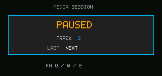

# Media Controls

<!-- doc-locale: en -->
> **English** | [简体中文](README.zh-CN.md)

This SDK 1.0 example registers the foreground application as a media session
and consumes the trusted System Shell's Play/Pause, Previous and Next actions.
It does not play audio and therefore requests no permissions.



## Controls

- `Fn+Q`: Play/Pause.
- `Fn+W`: Previous.
- `Fn+E`: Next.
- Space: application-local Play/Pause fallback.

Run all three global actions in the deterministic simulator:

```sh
cargo run -p cp0ctl -- run examples/media-controls \
  --duration 600 --permissions deny \
  --media-actions play-pause,previous,next \
  --output target/media-controls.ppm \
  --profile target/media-controls.json
```

On V0.6 hardware, `Fn+Q`, `Fn+W` and `Fn+E` are trusted global actions. Space
is an application-local Play/Pause fallback. Actual sound output is a separate
feature and requires the `audio.playback` manifest permission.

Media Controls is one of the eight applications included in the product image.
