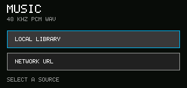

# Music

<!-- doc-locale: en -->
> **English** | [简体中文](README.zh-CN.md)

Music is the production audio player example for SDK 1.1. It streams 16-bit,
48 kHz, stereo PCM WAV audio without loading the whole track into App memory.
Playback combines bounded document reads into 40 ms audio chunks to tolerate
CM0 scheduling jitter without increasing the App's filesystem authority.

## Use

- Select **Local Library** to open a WAV file through the trusted Document
  Portal. The App receives no filesystem path.
- Select **Network URL**, enter a public HTTPS WAV URL and press Enter. The
  server must support byte-range responses.
- Space toggles play/pause. `R` restarts the current track. `F` stops playback
  and returns to the source screen.
- System media shortcuts are also routed through the bounded media session.

The first hardware release deliberately accepts only PCM WAV with exactly
48,000 Hz, two channels and 16 bits per sample. MP3, AAC and FLAC require the
future system decoder service and are rejected instead of being played with an
incorrect format.

Permissions are requested independently for local documents, network access
and audio playback. A denial can be changed later in Settings > Apps > Music >
Permissions.
