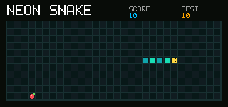

# Neon Snake

<!-- doc-locale: en -->
> **English** | [简体中文](README.zh-CN.md)

Neon Snake is a complete CardputerZero SDK 1.0 application. It renders a
320x150 RGB565 surface below the trusted system status bar, reads only focused
keyboard events and stores the best score in the application's isolated
private storage.



Controls:

- arrow keys: steer;
- Space: pause or resume;
- Enter or R: restart after the game ends.

Build and run it in the deterministic PC simulator from the repository root:

```sh
cargo run -p cp0ctl -- build examples/neon-snake
cargo run -p cp0ctl -- run examples/neon-snake \
  --duration 2400 --permissions deny \
  --keys up,left,down,right,space,space \
  --output target/neon-snake.ppm \
  --profile target/neon-snake.json
```

Create an unsigned reproducible application package:

```sh
cargo run -p cp0ctl -- package examples/neon-snake target/neon-snake.capp
```

Use `cp0ctl key generate`, `cp0ctl sign developer` and `cp0ctl install` as
described in `docs/DEVELOPER-GUIDE.md` when the target device is in developer
mode and trusts the developer public key.

The game requests no capabilities. Its frame buffer, fixed snake array and
game state are caller-owned static memory; there is no allocator and no Linux
compatibility API.

Neon Snake is one of the eight applications included in the product image.
