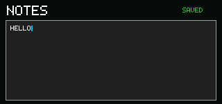

# 备注

<!-- doc-locale: zh-CN -->
> [English](README.md) | **简体中文**

Notes 是一个紧凑的、无需权限的文本编辑器。它接受 CardputerZero 打印ASCII布局，使用SDK字体渲染标点和字母大小写，并在应用的隔离私有存储中存储一个限制为192字节的草稿。



## 控制按钮

- 字母、数字、空格和符号键：插入文本。
- `Sym` 组合：插入打印符号。
- 输入: 开始新的一行。
- Backspace: 删除前一个字符。

草稿在最后一次编辑后自动保存，延迟600毫秒。空白草稿移除私有存储密钥。不需要文件系统或共享文档权限。

## 在模拟器中运行

```sh
cargo run -p cp0ctl -- run examples/notes \
  --duration 900 --permissions deny --keys h,e,l,l,o \
  --output target/notes.ppm
```

Notes 是包含在生产镜像中的八个应用程序之一。
