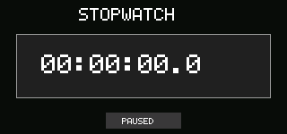

# Stopwatch

Stopwatch is a permission-free monotonic timer with tenth-of-a-second display
precision and a bounded 99-hour presentation.



## Controls

- Enter or Space: start or pause.
- `R`: reset the elapsed time.

## Run in the simulator

```sh
cargo run -p cp0ctl -- run examples/stopwatch \
  --duration 350 --permissions deny --keys enter,r,space \
  --output target/stopwatch.ppm
```

Stopwatch is one of the eight applications included in the product image.
